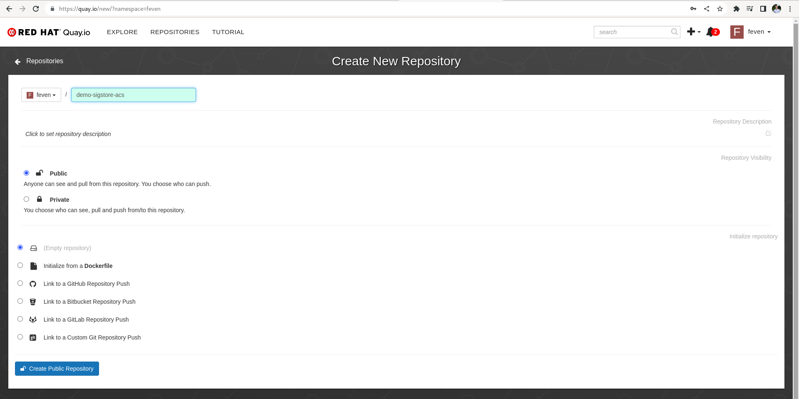
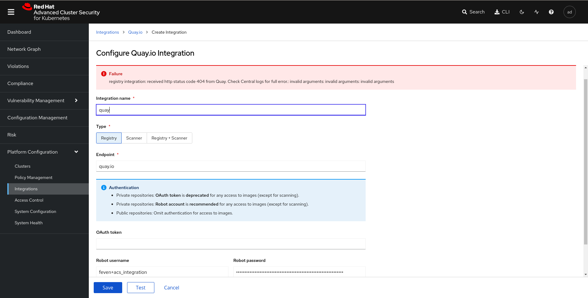
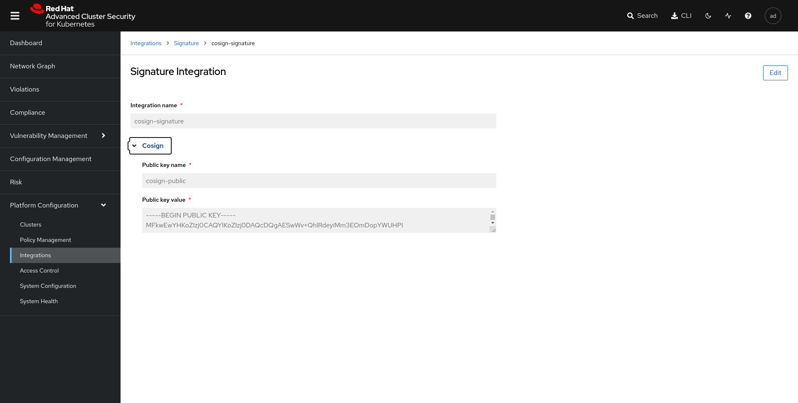
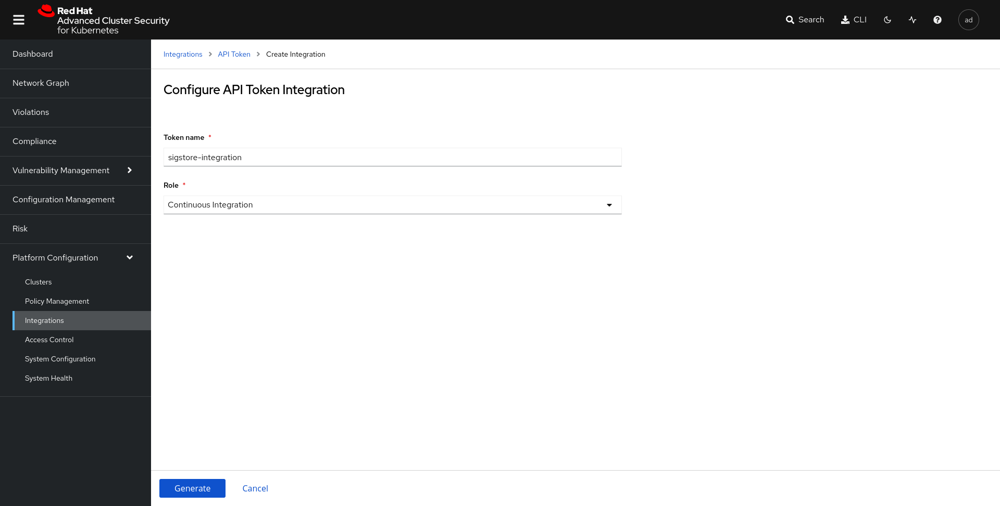

### Demonstration signstore integration with ACS on Openshift

### Prerequisites


- Install ACS and configured a secured cluster
- Install Openshift pipelines

### Quay configuration and credentials setup

In quay.io create a public repository, that will be used to store the image build by the pipeline.



Then create a robot accound that will be used by the pipeline service account in openshift.

Click on your username on the top left > Account settings > Robot Accounts > Create Robot Account > Provide a name for your bot > select the repo that we have create in the previous step > Select admin permission. 

Then click on Robot Account and copy the username and the password. 


```shell
export QUAY_TOKEN="XXX"
export EMAIL="XXX"
export USERNAME="feven+acs_integration"
export NAMESPACE="demo-sigstore-acs"
```

Create a namespace and the secret for the registry

```shell
oc create ns ${NAMESPACE}
oc create secret docker-registry regcred --docker-server=quay.io --docker-username=${USERNAME} --docker-email=${EMAIL}--docker-password=${QUAY_TOKEN} -n ${NAMESPACE}
```

Patch the service account to get access to the creds

```shell
export SERVICE_ACCOUNT_NAME=pipeline
kubectl patch serviceaccount $SERVICE_ACCOUNT_NAME \
 -p "{\"imagePullSecrets\": [{\"name\": \"regcred\"}]}" -n $NAMESPACE
oc secrets link pipeline regcred -n demo-sign
```

### Create pipeline

#### Build image

On the pipeline we will fetch an image, build it with sii, sign the image with sigstore, check the image with ACS, and deploy the image on Openshift.

To fetch and build the image we will used the default taks provided with openshift pipeline "git clone" and "buildah"

#### Sign image

Then we will create a task to sign image using cosign. To do that we need to generate key usging the cosign cli and that generate a secret with public and private key.

```shell
cosign generate-key-pair k8s://${NAMESPACE}/cosign
```

check that the cosign secret has been created in your namespace

```shell
$ oc get secret -n ${NAMESPACE} -oyaml

apiVersion: v1
data:
  cosign.key: xxxx
  cosign.password: xxxx
  cosign.pub: xxxx
immutable: true
kind: Secret
```

Then create a tekton task that will use the private key to sign the image 

```shell
apiVersion: tekton.dev/v1beta1
kind: Task
metadata:
  annotations:
    tekton.dev/pipelines.minVersion: 0.12.1
  name: cosign
  labels:
    app.kubernetes.io/version: 0.1.0
spec:
  description: >-
    These tasks make it possible to use cosign within your Tekton pipelines
    cosign is a tool for signing and verifying software artifacts.
  params:
    - name: cosignkey
      type: string
    - name: image
      type: string
    - name: namespace
      type: string
  results:
    - description: The email from the certificate common name in JSON format
      name: email
  steps:
    - env:
        - name: COSIGN_EXPERIMENTAL
          value: '1'
      image: 'gcr.io/projectsigstore/cosign:v1.13.0'
      volumeMounts:
        - mountPath: /home/nonroot/.docker/
          name: regcred
          readOnly: true
      name: cosign
      resources: {}
      script: >
        #!/bin/sh

        CMD="cosign sign --key k8s://$(params.namespace)/$(params.cosignkey) $(params.image)"

        echo "${CMD}"

        ERR_MSG="Failed to sign $(params.image)"

        ${CMD} &> result

        err=$?

        cat result
         
        if [[ ${err} -ne 0 ]]; then
          echo "${ERR_MSG}"
          exit 1
        fi

      workingDir: /workspace/source
  volumes:
    - emptyDir: {}
      name: varlibcontainers
    - name: regcred
      secret:
        items:
          - key: .dockerconfigjson
            path: config.json
        secretName: regcred

  workspaces:
    - name: source
```

#### Check the image signature using ACS

Then we will create a task that gonna use ACS api to check that the image is signed. 

To do that go in the ACS GUI > Integrations > Quay.io > New integrationand provide the quay.io credentials that has been generated previously :



Then we will add the cosign publickey in rhacs to allow the checking

Go in integrations signature and provide the key value.



Then we need to create a stackrox policy that will check sigstore signature.

Go in Policy Management > Import policy and paste the following json file

```shell
{
    "policies": [
        {
            "id": "c8fde2c3-980c-40e3-bc9d-6245b13ab81e",
            "name": "Trusted_Signature_Image_Policy",
            "description": "Alert on Images that have not been signed",
            "rationale": "rationale",
            "remediation": "All images should be signed by our cosign-demo signature",
            "disabled": false,
            "categories": [
                "Security Best Practices"
            ],
            "lifecycleStages": [
                "BUILD",
                "DEPLOY"
            ],
            "severity": "HIGH_SEVERITY",
            "enforcementActions": [],
            "notifiers": [],
            "SORTName": "",
            "SORTLifecycleStage": "",
            "SORTEnforcement": true,
            "policyVersion": "1.1",
            "policySections": [
                {
                    "sectionName": "Policy Section 1",
                    "policyGroups": [
                        {
                            "fieldName": "Image Signature Verified By",
                            "booleanOperator": "OR",
                            "negate": false,
                            "values": [
                                {
                                    "value": "io.stackrox.signatureintegration.f9352803-d5c9-45d6-abe0-e1361a24559a"
                                }
                            ]
                        }
                    ]
                }
            ],
            "mitreAttackVectors": [],
            "criteriaLocked": false,
            "mitreVectorsLocked": false,
            "isDefault": false
        }
    ]
}
```

Click on begin import

Then integrate tekton pipeline with ACS with API Token. Go in integrations > Api Token > Generate token > Complete the name and select continuous integration > Click on generate



Put the Token in an environment variable and generate the secret 

```shell
ACS_ROUTE=$(oc get route -n rhacs-operator central -o jsonpath='{.spec.host}')
ROX_API_TOKEN=YOURTOKEN
cat > /tmp/roxsecret.yaml << EOF
apiVersion: v1
data:
  rox_api_token: "$(echo $ROX_API_TOKEN | tr -d '\n' | base64 -w 0)"
  rox_central_endpoint: "$(echo $ACS_ROUTE:443 | tr -d '\n' | base64 -w 0)"
kind: Secret
metadata:
  name: roxsecrets
  namespace: ${NAMESPACE}
type: Opaque
EOF

oc apply -f /tmp/roxsecret.yaml
```

Finally create a task to check the image

```shell
apiVersion: tekton.dev/v1beta1
kind: Task
metadata:
  name: rox-image-check
spec:
  params:
    - description: >-
        Secret containing the address:port tuple for StackRox Central (example -
        rox.stackrox.io:443)
      name: rox_central_endpoint
      type: string
    - description: Secret containing the StackRox API token with CI permissions
      name: rox_api_token
      type: string
    - description: 'Full name of image to scan'
      name: image
      type: string
  results:
    - description: Output of `roxctl image check`
      name: check_output
  steps:
    - env:
        - name: ROX_API_TOKEN
          valueFrom:
            secretKeyRef:
              key: rox_api_token
              name: $(params.rox_api_token)
        - name: ROX_CENTRAL_ENDPOINT
          valueFrom:
            secretKeyRef:
              key: rox_central_endpoint
              name: $(params.rox_central_endpoint)
      image: registry.access.redhat.com/ubi8/ubi-minimal:latest
      name: rox-image-check
      resources: {}
      script: >-
        #!/usr/bin/env bash

        echo $ROX_CENTRAL_ENDPOINT
        ROX_API_TOKEN=$(echo $ROX_API_TOKEN | sed -e 's/\\n//g')

        curl -k -L -H "Authorization: Bearer $ROX_API_TOKEN" https://$ROX_CENTRAL_ENDPOINT/api/cli/download/roxctl-linux --output ./roxctl  > /dev/null; echo "Getting roxctl"

        chmod +x ./roxctl > /dev/null

        ./roxctl image check --insecure-skip-tls-verify -e $ROX_CENTRAL_ENDPOINT
        --image $(params.image)
      workingDir: /workspace/source
  workspaces:
    - name: source
```

### apply manifest

Create a task to apply the manifest if the check has been passed :


```shell
apiVersion: tekton.dev/v1beta1
kind: Task
metadata:
  name: apply-manifests
spec:
  params:
    - default: k8s
      description: The directory in source that contains yaml manifests
      name: manifest_dir
      type: string
  steps:
    - args:
        - |-
          echo Applying manifests in $(inputs.params.manifest_dir) directory
          oc apply -f $(inputs.params.manifest_dir)
          echo -----------------------------------
      command:
        - /bin/bash
        - '-c'
      image: 'image-registry.openshift-image-registry.svc:5000/openshift/cli:latest'
      name: apply
      resources: {}
      workingDir: /workspace/source
  workspaces:
    - name: source             
```

#### Generate the pipeline

We can now create the pipeline. We add a pvc.

```shell
apiVersion: tekton.dev/v1beta1
kind: Pipeline
metadata:
  name: build-and-deploy-signed
spec:
  params:
    - description: name of the deployment to be patched
      name: deployment-name
      type: string
    - description: url of the git repo for the code of deployment
      name: git-url
      type: string
    - default: master
      description: revision to be used from repo of the code for deployment
      name: git-revision
      type: string
    - description: image to be build from the code
      name: IMAGE
      type: string
    - default: workshop
      description: Namespace where the Tekton project is installed by the release
      name: namespace
      type: string
  tasks:
    - name: fetch-repository
      params:
        - name: url
          value: $(params.git-url)
        - name: deleteExisting
          value: 'true'
        - name: revision
          value: $(params.git-revision)
      taskRef:
        kind: ClusterTask
        name: git-clone
      workspaces:
        - name: output
          workspace: shared-workspace
    - name: buildah-custom
      params:
        - name: IMAGE
          value: $(params.IMAGE)
        - name: BUILDER_IMAGE
          value: >-
            registry.redhat.io/rhel8/buildah@sha256:e19cf23d5f1e0608f5a897f0a50448beb9f8387031cca49c7487ec71bd91c4d3
        - name: STORAGE_DRIVER
          value: vfs
        - name: DOCKERFILE
          value: ./Dockerfile
        - name: CONTEXT
          value: .
        - name: TLSVERIFY
          value: 'true'
        - name: FORMAT
          value: oci
      runAfter:
        - fetch-repository
      taskRef:
        kind: ClusterTask
        name: buildah-custom
      workspaces:
        - name: source
          workspace: shared-workspace
    - name: sign-image
      params:
        - name: image
          value: $(params.IMAGE)
        - name: namespace
          value: $(params.namespace)
        - name: cosignkey
          value: cosign
      runAfter:
        - buildah-custom
      taskRef:
        kind: Task
        name: cosign
      workspaces:
        - name: source
          workspace: shared-workspace
    - name: check-image
      params:
        - name: rox_api_token
          value: roxsecrets
        - name: rox_central_endpoint
          value: roxsecrets
        - name: image
          value: $(params.IMAGE)
      runAfter:
        - sign-image
      taskRef:
        kind: Task
        name: rox-image-check
      workspaces:
        - name: source
          workspace: shared-workspace
    - name: apply-manifests
      runAfter:
        - check-image
      taskRef:
        kind: Task
        name: apply-manifests
      workspaces:
        - name: source
          workspace: shared-workspace
    - name: update-deployment
      params:
        - name: deployment
          value: $(params.deployment-name)
        - name: IMAGE
          value: $(params.IMAGE)
      runAfter:
        - apply-manifests
      taskRef:
        kind: Task
        name: update-deployment
  workspaces:
    - name: shared-workspace
```

```shell
apiVersion: v1
kind: PersistentVolumeClaim
metadata:
  name: source-pvc
spec:
  accessModes:
    - ReadWriteOnce
  resources:
    requests:
      storage: 500Mi
```

### Trigger the pipeline


